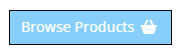
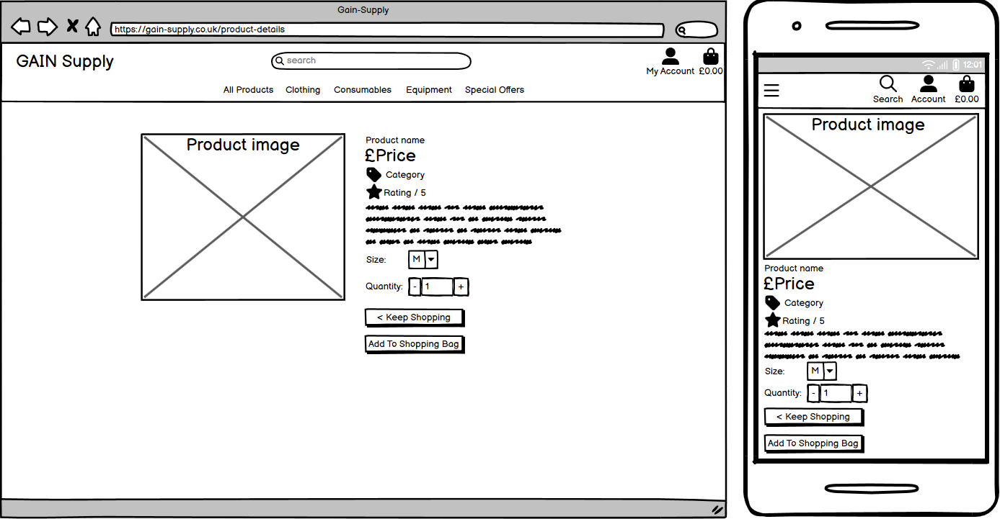
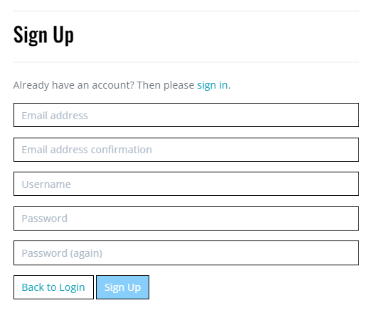

# GAIN Supply

GAIN Supply is a fitness supplies store. It supplies a range of products from supplements and healthy food to fitness equipment. It will be beneficial to customers as it aims to provide a convenient place to find all of the supplies they need, rather than shop through multiple different sites. Users will be able to create profiles, storing their shipping information if they choose to and view their order history. Admin users can add, edit and delete products. Admins can also add to customer testimonials or remove them from the testimonials page.

## Table of Contents

**[1. User Experience](#user-experience)**
* [1.1 User Information](#user-information)
* [1.2 Design](#design)
* [1.3 User Stories](#user-stories)

**[2. Features](#features)**
* [2.1 Existing Features](#existing-features)
* [2.2 Features Left to Implement](#features-left-to-implement)

**[3. Testing](#testing)**

**[4. Technologies](#technologies)**
* [4.1 Languages](#languages)
* [4.2 Libraries & Programs Used](#libraries--programs-used)

**[5. Deployment](#deployment)**  
* [5.1 Deploying this repository](#deploying-this-repository)
* [5.2 Cloning this repository](#cloning-this-repository)
* [5.3 Forking this repository](#forking-this-repository)

**[6. Credits](#credits)**
* [6.1 Media](#media)
* [6.2 Code](#code)

## User Experience

### User Information

#### Typical Users

The main users of the site will be:
* Shoppers
* General
* Admin

#### User Stories

##### Shoppers

The main demographic for the site is shoppers looking to make a purchase.

1. As a shopper, I would like to be able to view products so I can make a purchase.
2. As a shopper, I would like to be able to view product details so I can feel secure in making a purchase.
3. As a shopper, I would like to be able to quickly find special offers so I can easily make a saving on a purchase.
4. As a shopper, I would like to be able to view my basket price at all times so I can avoid over-purchasing.
5. As a shopper, I would like to be able to sort products so I can easily find the ones I'm looking for.
6. As a shopper, I would like to be able to sort by category so I can find the best of a certain type of product.
7. As a shopper, I would like to be able to sort products by price so I can shop to a budget.
8. As a shopper, I would like to be able to search products by name so I can find what I need quickly.
9. As a shopper, I would like to be able to see how many products my search finds so I can tell if the site has what I need.
10. As a shopper, I would like to be able to easily select the quantity and size of products to ensure my order is correct.
11. As a shopper, I would like to be able to view my basket so I can remember what I have selected to purchase.
12. As a shopper, I would like to be able to be able to adjust quantity from the basket so I can easily correct any problems with my order.
13. As a shopper, I would like to be able to easily add my payment information so the process is fast.
14. As a shopper, I would like to know my payment information is secure to make safe purchases.
15. As a shopper, I would like to be able to view my order confirmation so I can confirm what I have ordered and that it was successful.
16. As a shopper, I would like to be able to receive my order confirmation by email so I have a copy for my own records.

##### General

1. As a general user, I would like to be able to easily register so that I can have my own account and profile.
2. As a general user, I would like to be able to log in and out so I can check my account information and keep it safe.
3. As a general user, I would like to be able to recover my password so I don't get locked out of my account if I forget it.
4. As a general user, I would like to receive a email confirmation when I register for an account so I know it has been created successfully.
5. As a general user, I would like to have a personalised account so I can see my order history, address and payment information.

##### Admin

1. As a admin user, I would like to be able to add products so I can add future products to sell.
2. As a admin user, I would like to be able to edit existing products so I can fix any errors or adjust price if necessary.
3. As a admin user, I would like to be able to delete products so I can remove any products the store no longer stocks.

### Design

#### Typography

There are 2 main fonts used across the whole of the site, they have been selected from [Google-Fonts](https://fonts.google.com/). These are Oswald and Open Sans. 

Oswald was selected for the company logo as it has a nice clean look that suits bold text and headings well. To keep things consistent and improve user experience the headings for each page also use the Oswald font. This helps make the site look professional.

Open Sans was chosen for the body because it is easy to read and fairly simplistic. It matches quite well with the Oswald font used for the logo and headings. The difference between the two fonts helps people search through the site faster and find what they are looking for easier.

#### Icons

All icons for the site have been taken from [Fontawesome](https://fontawesome.com/).

In the navbar you can find the first 3 icons.

1. Shopping bag (fas fa-shopping-bag): This icon was selected for the shopping bag element of the site because it's purpose is easily recognisable and familiar to users already. When there are products in the bag the icon changes colour, this makes it easier for customers to see if they have got any products selected yet.
2. User icon (fas fa-user): This icon was selected for the user profile element of the site because similarly to the shopping bag it's purpose is easily recognisable and familiar to users already.
3. Search icon (fas fa-search): This icon was selected for the user search feature of the site because similarly to the shopping bag and user icon it's purpose is easily recognisable and familiar to users already. The icon looks slightly different on mobile as it looks better matching the other icons due to lack of space.

The next two icons can be found on the product cards when browsing products on the site.

1. Item tag (fas fa-tag): The tag icon was selected for the price tag icon as similarly to most icons on the site it's purpose is easily recognisable and familiar to users already. Unlike some of the icons it is also recognisable from shopping in person. 
2. Rating star (fas fa-star): The star icon was chosen for the rating section because it is very common to hear things rated out of 5 or 10 stars. This helps users instantly recognise that the number represents a star-rating.

The next three icons can be found on the product details page.

1. Minus icon (fas fa-minus): The minus symbol was selected for the site because it is globally recognised and looks good in the quantity selector.
2. Plus icon (fas fa-plus): The plus symbol was selected for the site because it is globally recognised and looks good in the quantity selector alongside the minus icon.
3. Back icon (fas fa-chevron-left): The chevron left icon was chosen to represent all links that direct the user backwards through the process of navigating the site. Here it can be seen in the Keep Shopping button. This helps give the buttons context and makes them more obvious to the user so they can easily find them.

The next icon is only found on error pages.

1. Shopping basket (fa-solid fa-basket-shopping): This icon is found on error pages and helps give the user an alternative option to going back to the home page. The meaning of the basket is quite clear and it was selected because it is noticeably different to the bag icon and that will help prevent users from getting confused between the two. 

The next three icons are part of the checkout process.

1. Lock (fas fa-lock): The lock icon was selected for the Secure Checkout button because it hopes to make the user feel confident that their payment information is safe and secure. 
2. Exclamation circle (fas fa-exclamation-circle): The exclamation circle was chosen for the payment warning as it is a small but very noticeable icon, especially when paired with the bright red colour. This is useful as it provides the user with one last warning before they pay of how much their order will cost.
3. Spinning processing wheel (fas fa-3x fa-sync-alt fa-spin): This icon was selected for the order processing spinning wheel as it provides a clean way to communicate to the user that the order is being finalised. See below.

#### Colours

The following colours have been used for the colour scheme of the site:
1. #87cefa - Light Sky Blue: This was selected as the company colour scheme, featuring in the logo and on many of the buttons across the site. Typically where the colour is used you while have white text instead of black as it is more visually appealing.
2. #ffffff - White: White was chosen to be used as the text colour for all blue buttons as it pairs much better with the light sky blue than black does.
3. #000000 - Black: Black is used for all headings or text against a plain white background, which makes up the majority of pages. This is to make sure that the user doesn't find it hard to see any of the content.

Additional colours:
#dc3545 - Red: Red is found only on warning messages and delete functions. This is to alert the user that they should be careful to avoid making a mistake and try reduce accidents.

#### Wireframes

##### Home

##### Products

##### Product Details

##### Bag

##### Checkout

##### Profile

##### Testimonials

## Features

### Database Model

This is the database model. The two non-related databases are Testimonials (covered in detail in features) and the employee profile database. The Employee Profile database is only there for admin users so they can store information on other employees should they ever need it. This would be useful for having somewhere to find contact details in the case of any emergencies.

### Existing Features

#### UX Features

1. Home Page

    
    This is the home page for the site. It has been created with a eye-catching blue colour to fit well with the theme throughout. Here the users can also easily start navigating through the site with lots of options to choose from. On top of the usual navbar options there are two call to action buttons, one to entice new users to browse products and the other to look at testimonials.

2. View Products & Product Details

    

    This is the products view. It is designed to show less products per row when the user is on smaller devices. Any user can browse the products and click on them for more details or to add them to the shopping bag. This meets the first of the Shopper User Stories, being able to view the products. You can see the individual product details page below, which meets the second of the Shopper User Stories which is viewing the product details.

    

    The product details page allows you to select the size and quantity of the item you would like. This addresses Shopper User Story 10.

3. Filtering, Searching and Sorting Products

    

    Here on the products related views you can find the filter, searching and sorting functionality of the site. Users have plenty of options to choose from to decide how they would like to browse. The search bar can be found at the top of the page. Search functionality meets the requirements of Shopper User Stories number 8 and 9. You can see a search result below.

    

    The sort feature helps the site meet the requirements of Shopper User Stories 3, 5, 6 and 7. Here you can select to sort by price, rating, name or category. The products top navigation allows you to sort through the different categories, shown below.

    
    
    
    

4. View Testimonials

    

    This is the testimonials page. Here new visitors to have a chance to read the reviews left by previous customers. Unfortunately at this time users can not add them but this functionality could be added in a future update. This is good for the user experience because people can gain confidence in the site before placing an order.

5. Pop Up Messages 

    

    This is an example of the pop up toasts that appear on the site. They are also used for a range of other features, such as error messages and order confirmation. These improve the experience of the user because it makes it clear when you have performed certain actions by providing feedback. 

#### E-Commerce Features

1. Shopping Bag

    
    

    The shopping bag can be accessed from clicking on the bag icon. When empty the icon is black but if a user adds any products it will change colour, making it easy to know if you have added things. This addresses the need outlined in Shopper User Story number 4.

    

    This is the shopping bag page. This allows users to see the products they have selected, along with their size, price and quantities. The user can also see the total price of their order, remove items or adjust the quantities. This fufills the criteria from Shopper User Stories 11 and 12.

2. Checkout

    

    This is the checkout page. Here users can fill in the form with their personal, shipping and payment information. The secure checkout is provided by stripe. The user is prompted to register for an account if they are not logged in, if they are it will ask the user if they would like to save their details for next time. This meets the requirements of Shopper User Stories 13 and 14.

3. Order Confirmation

    

    This is the order confirmation page. This shows the user the details of their order so they can check it over and make sure there are no mistakes, it also helps them know their order has been successful. The pop up message lets the user know that a copy of the order confirmation has been sent to the email address they provided in the form. This meets the requirements from Shopper User Stories 15 and 16.

4. Quantity and Size Selectors

    

    These are the quantity and size selectors from the product detail page. These allow users to easily choose the size and quantity of a product they would like. This is a requested feature from Shopper User Story 10.

#### Profile Features

1. User Registration

    

    This is the user registration form. It is designed to be short so that the user is more inclined to fill it out. Once they have their account is when they fill in the rest of their details. Once submitted it will send a confirmation email to the account provided in the form with a confirmation link to verify their email. This meets the needs from General User Story 1 and 4.

2. Log In

    

    This is the log in form. The user must enter their Username and Password and submit the form. There is a Remember Me option so the user can store their details for faster access next time. If the user has forgot their password they can click the Forgot Password link. There is a button to go Home if the user doesn't want to log in. This addresses the needs from General User Story 2 and 3.

    

3. Log Out

    

    Users can log out by clicking the accounts icon and then log out. The log out option is displayed to the user and they have to confirm by clicking the Sign Out button.

4. Profile Page

    

    This is the profile page. It gives the user the option to add or update their delivery details to make checkout faster. On the right users can see the order history. This is part of General User Story 5.

5. Order History 

    

    Users can access their order history from their personal profile page. It shows the user any previous orders they've placed; order number, date, products and total cost. Clicking on any of the order numbers will take users to the order confirmation view where they can find a more in depth description. This finalises General User Story 5.

#### Admin Features

1. Accounts

    Admin accounts are available for users from within the organisation. They are able to access more features than typical users such as adding, editing and deleting products. The Product Management section for adding new products can be found in the accounts dropdown list.

    

2. Add Product

    

    This is the add product page for admin users, found in the Product Management section. Here admins can add new products to the site for customers to buy. Required fields are indicated by an asterix. This was requested by the store in Admin User Story 1.

3. Edit Product

    

    The ability to edit products is found within the products and product detail pages. These links only show for admin users. If the admin clicks the edit products it opens a form where they can change the data in any of the fields and save changes if they wish. This meets the needs from Admin User Story 2. See below.

    

4. Delete Product 

    

    The ability to delete products is found within the products and product detail pages. These links only show for admin users. If the admin clicks Delete it removes the item from the site. They will be shown a pop up message to confirm that the product has been deleted. This meets the needs from Admin User Story 3. See below.

    

### Possible Future Features

1. Ability for admin to add, edit and delete testimonials outside of the admin panel. Unfortunately due to time constraints the testimonials cannot be changed like the products can. If there was to be a future update to the site it would be a high priority feature so that admins can update them as new testimonials came in.
2. To extend the Testimonial functionality further it would be good to provide a form for users to send in their own Testimonials, which Admin could pick from to display.
3. Finally, building on Testimonials more there could be a 'Most Recent' section which automatically displays the 10 most recently submitted Testimonials for Users to look at. 

## Testing

| Test Group      | Test Label                           | Action                                                                                            | Expected Outcome                                                                                                  | Outcome |
| --------------- | ------------------------------------ | ------------------------------------------------------------------------------------------------- | ----------------------------------------------------------------------------------------------------------------- | ------- |
| Navigation/UX   | Logo home link                       | From any page, click the GAIN Supply logo in the header.                                          | The user will be taken back to the home page.                                                                     | PASS    |
|                 | Search function                      | From any page, enter a product name in to the search bar and click the search icon.               | The user will be shown products matching the name entered and the number of results found.                        | PASS    |
|                 | My Account dropdown                  | From any page, click on the My Account icon in the header.                                        | The options to register and login should be shown to the user.                                                    | PASS    |
|                 | My Account Register link             | From any page, click on the Regsiter link in the My Account dropdown list.                        | The user will be taken to the sign up page.                                                                       | PASS    |
|                 | My Account Login link                | From any page, click on the Login link in the My Account dropdown list.                           | The user will be taken to the login page.                                                                         | PASS    |
|                 | Bag header link                      | From any page, click on the Bag icon in the header.                                               | The user will be taken to the bag page.                                                                           | PASS    |
|                 | Browse Products button               | From the home page, click the Browse Products button.                                             | The user will be taken to the products page.                                                                      | PASS    |
|                 | Testimonials button                  | From the home page, click the Testimonials button.                                                | The user will be taken to the testimonials page.                                                                  | PASS    |
|                 | Product dropdown lists               | From any page, click on the different product dropdown lists.                                     | The user will be shown the options to filter and sort the products by category.                                   | PASS    |
|                 | Button hover effect                  | From the home page, hover over the browse and testimonial buttons.                                | The button text will become bold whilst the mouse hovers over them.                                               | PASS    |
| Products        | Sort by selector box                 | On the All Products view, click through the options in the Sort By selector box.                  | The order of products being displayed should change with every change to the Sort By option.                      | PASS    |
|                 | Dropdown sort by price               | From any page, click By Price in the All Products dropdown list.                                  | The user will be shown all products, displayed in order of lowest to highest price.                               | PASS    |
|                 | Dropdown sort by rating              | From any page, click By Rating in the All Products dropdown list.                                 | The user will be shown all products, displayed in order of highest to lowest rating.                              | PASS    |
|                 | Dropdown sort by category            | From any page, click By Category in the All Products dropdown list.                               | The user will be shown all products, displayed in order of their categories A-Z.                                  | PASS    |
|                 | Category dropdown lists              | From any page, click through the options in each Category dropdown list.                          | The user will be shown all products that belong to the selected category or sub-category.                         | PASS    |
|                 | Back to all products link            | With a category selected or search entered, click the Back to all products link.                  | The user will be returned to the all products view and the sorting methods removed.                               | PASS    |
|                 | Sub-category buttons                 | From within a category of products, click the sub-category buttons beneath the title.             | The user will be shown only the products belonging to the selected sub-category.                                  | PASS    |
| Product details | Size selector                        | From the details page of clothing (not-trainers) click on the size selector dropdown.             | The user will be allowed to choose from the available sizes (S, M, L).                                            | PASS    |
|                 | Size selector (trainers)             | From the details page of trainers click on the size selector dropdown.                            | The user will be allowed to choose from the available sizes (9, 10, 11).                                          | PASS    |
|                 | Quantity selector                    | From the details page of a product, try increase and decrease the quantity with +/- buttons.      | The quantity should increase by 1 with the plus button, decrease by 1 with the minus.                             | PASS    |
|                 | Keep Shopping button                 | From the details page of a product, click on the Keep Shopping button.                            | The user should be returned to the all products view.                                                             | PASS    |
|                 | Add To Shopping Bag button           | From the details page of a product, click on the Add To Shopping Bag button.                      | The selected product should be added to the users shopping bag.                                                   | PASS    |
|                 | Add To Shopping Bag toast            | From the details page of a product, click on the Add To Shopping Bag button.                      | A success message should appear with the current bag contents, including size, price and quantity.                | PASS    |
|                 | Go To Checkout toast link            | After adding a product to the shopping bag, click the Go To Checkout button.                      | The user should be taken to the bag page.                                                                         | PASS    |
|                 | Expand image                         | From the details page of a product, click on the image.                                           | The user should be displayed a full-size version of the image in a new window.                                    | PASS    |
| Bag             | Empty bag                            | From any page, click the shopping bag icon before adding any products.                            | The page should tell the user they haven't added any products and provide a Keep Shopping button.                 | PASS    |
|                 | Products displayed                   | Visit the bag page with some products added to the bag.                                           | The bag page should show a list of all products selected.                                                         | PASS    |
|                 | Keep Shopping button                 | From the bag page, click on the Keep Shopping button.                                             | The user should be returned to the all products view.                                                             | PASS    |
|                 | Free delivery message                | Visit the bag page with less than £30 of products added to the bag.                               | The user should be prompted to spend £x.xx more to get free delivery.                                             | PASS    |
|                 | Bag total                            | Add products to the shopping bag.                                                                 | The bag total should equal the sum of the added products.                                                         | PASS    |
|                 | Delivery charge                      | Visit the bag page with less than £30 of products added to the bag.                               | The delivery charge should be active and added to the bag total.                                                  | PASS    |
|                 | Grand total                          | Visit the bag page with some products added to the bag.                                           | The grand total should equal the sum of the bag total added to the delivery charge.                               | PASS    |
|                 | Adjust quantity                      | Change the quantity of a product in the bag and click Save Changes.                               | The quantity of the product in the bag should be updated.                                                         | PASS    |
|                 | Minus de-activation at 1             | Attempt to reduce the quantity below 1 using the minus button.                                    | The button should become inactive when the quantity equals 1.                                                     | PASS    |
|                 | Adjust quantity to 0                 | Manually enter 0 to the quantity selector and click Save Changes.                                 | The product should be removed from the bag.                                                                       | PASS    |
|                 | Adjust quantity toast                | Change the quantity of a product in the bag and click Save Changes.                               | The user should be shown a success toast message with the updated bag contents.                                   | PASS    |
|                 | Remove Item button                   | Click the Remove Item button on an item in the shopping bag.                                      | The product should be removed from the bag.                                                                       | PASS    |
|                 | Remove Item toast                    | Click the Remove Item button on an item in the shopping bag.                                      | The user should be shown a success toast message containing the name of the remove product.                       | PASS    |
|                 | Secure Checkout button               | Click the Secure Checkout button with products in the shopping bag.                               | The user will be taken to the checkout page.                                                                      | PASS    |
| Checkout        | Display order                        | Visit the checkout page with products in bag.                                                     | The users order information should be displayed on the right.                                                     | PASS    |
|                 | Empty form                           | Click Confirm Order button before adding any data to the form.                                    | The user should be directed to the first missing required field to fill in.                                       | PASS    |
|                 | Confirm Order button                 | Attempt to submit the form with all fields filled.                                                | The checkout should finish successfully and redirect the user to their order confirmation.                        | PASS    |
|                 | Required fields                      | Attempt to submit the form with a required field missing, repeat for all applicable fields.       | The user should be directed to fill in the missing required field.                                                | PASS    |
|                 | Non-required fields                  | Submit the form whilst only filling in the required fields.                                       | The form should submit without any issues.                                                                        | PASS    |
|                 | Loading-spinner                      | Attempt to submit the form with all fields filled.                                                | The loading spinner animation should happen whilst the checkout is processed.                                     | PASS    |
|                 | Back To Bag button                   | On the Checkout page, click the Back To Bag button.                                               | The user should be taken back to the bag page.                                                                    | PASS    |
|                 | Product image link                   | On the Checkout page, click on the image of a product.                                            | The user should be taken to the selected product details page.                                                    | PASS    |
|                 | Create account & login prompt        | Visit the checkout whilst not logged in.                                                          | The user will see a message prompting them to create an account or login to save their address.                   | PASS    |
|                 | Create account link                  | Visit the checkout whilst not logged in and click the Create Account link.                        | The user will be redirected to the account registration form.                                                     | PASS    |
|                 | Login link                           | Visit the checkout whilst not logged in and click the Login link.                                 | The user will be redirected to the login page.                                                                    | PASS    |
|                 | Invalid card details                 | Attempt to fill in the payment form with invalid data.                                            | A warning message will be displayed and the form field will be highlighted red.                                   | PASS    |
|                 | Checkout no login                    | Complete the checkout process without a user account.                                             | After the loading animation the user is directed to the order confirmation.                                       | PASS    |
|                 | Checkout logged in                   | Complete the checkout process with a user account.                                                | After the loading animation the user is directed to the order confirmation. Order added to history.               | PASS    |
|                 | Checkout success toast               | Complete the checkout process with valid data.                                                    | The user will receive a success message confirming the order and where the confirmation has been emailed.         | PASS    |
|                 | Save details for next time           | Complete the checkout process with a user account. Check save details for next time.              | After the checkout process has been completed, the details in the profile will have updated.                      | PASS    |
|                 | Confirmation Back To Products        | After completing the checkout process, click the Back To Products button on the page.             | The user will be returned to the all products view.                                                               | PASS    |
| Profile         | Register                             | Visit the sign up form by following the Register link and create a new account.                   | The user will be redirected to the verify email address page. The profile will be created successfully.           | PASS    |
|                 | Register Back To Login button        | Visit the sign up form and click the Back To Login button.                                        | The user will be redirected back to the sign in form.                                                             | PASS    |
|                 | Register Sign In link                | Visit the sign up form and click the sign in link.                                                | The user will be redirected to the sign in form.                                                                  | PASS    |
|                 | Sign in                              | Sign in to a user profile.                                                                        | The user will be signed in and taken back to the home page.                                                       | PASS    |
|                 | Sign in sign up link                 | On the sign in page, click the sign up link.                                                      | The user will be redirected to the sign up form.                                                                  | PASS    |
|                 | Sign in remember me                  | Sign in to a user profile with the remember me box checked.                                       | The users details should be pre-filled next time they try to log in.                                              | PASS    |
|                 | Sign in forgot password link         | On the sign in page, click the forgot password link.                                              | The user should be redirected to the password reset page.                                                         | PASS    |
|                 | Forgot password Reset Password       | Enter email address in to the password reset form and click Reset My Password.                    | The user should receive an email with a link to change their password.                                            | PASS    |
|                 | Change password email link           | Using the url provided in the email, visit the change password page.                              | The user should arrive at the change password page.                                                               | PASS    |
|                 | Forgot password Back To Login        | Click Back To Login on the forgot password page.                                                  | The user should arrive at the sign in page.                                                                       | PASS    |
|                 | Change password Back To Login        | Click Back To Login on the change password page.                                                  | The user should arrive at the sign in page.                                                                       | PASS    |
|                 | Change password                      | Provide 2 valid matching passwords on the change password page and click change password.         | The view should change to say your password is now changed, along with a success toast.                           | PASS    |
|                 | Sign in home link                    | Click the Home link on the sign in page.                                                          | The user should be taken back to the home page.                                                                   | PASS    |
|                 | Sign in toast                        | Sign in to a user profile.                                                                        | The user will be signed in and a success message will pop up to let the user know it worked.                      | PASS    |
|                 | Sign out                             | Log out of a user profile. Click the Logout option from Account dropdown, then log out button.    | The user will be redirected to the home page and logged out.                                                      | PASS    |
|                 | Sign out toast                       | Log out of a user profile. Click the Logout option from Account dropdown, then log out button.    | The user will be logged out and a success message will pop up to let the user know it worked.                     | PASS    |
|                 | Sign out cancel                      | Click on logout, then click the cancel button.                                                    | The user will be taken to the home page but stay logged in.                                                       | PASS    |
|                 | Try register with missing data       | Attempt to submit the form with a required field missing, repeat for all fields.                  | The user should be directed to fill in the missing required field.                                                | PASS    |
|                 | Try register with invalid password   | Attempt to choose a password of '1'.                                                              | The field will go red and the errors will be displayed to the user.                                               | PASS    |
|                 | Try register with invalid email      | Attempt to submit an invalid email without a '@'.                                                 | The user will be prompted with a message to add a correct email address.                                          | PASS    |
|                 | Try register with invalid username   | Attempt to create a username with just one character.                                             | The user will be prompted to choose a username with at least 4 characters.                                        | PASS    |
|                 | Try register without matching fields | Try attempt to submit with 2 different emails, repeat for password.                               | The user will be warned that the fields don't match and not submit.                                               | PASS    |
|                 | Update delivery details              | Log in to a user profile, change the delivery details and click Save Changes.                     | The user delivery details will be changed when you revisit the page.                                              | PASS    |
|                 | Update delivery details toast        | Log in to a user profile, change the delivery details and click Save Changes.                     | The details will change and a pop up message will let the user know they were updated successfully.               | PASS    |
|                 | Order history displayed              | After completing an order whilst logged in, confirm order shows in Order History on profile page. | The recently completed order will be shown in the order history section of the profile page.                      | PASS    |
|                 | Order history link                   | Click on any Order Number link in Order History section of profile page.                          | The user will be redirected to the orders details.                                                                | PASS    |
|                 | Order history alert toast            | Click on any Order Number link in Order History section of profile page.                          | The alert message will pop up and tell the user about the order they have clicked on.                             | PASS    |
|                 | Order history Back To Profile button | View an order details page in Order History, then click Back To Profile button.                   | The user will be taken back to their profile page.                                                                | PASS    |
|                 | Verify email address                 | Using the url provided in the email, confirm the email address by clicking Confirm button.        | The user will be redirected to the sign in page and a pop up success message will let you know it was successful. | PASS    |
| Admin           | Log in to admin account              | Sign in to current admin account.                                                                 | The user should log in and a success meesage will confirm it along with the account name.                         | PASS    |
|                 | Product Management link              | As an admin user, click the My Account dropdown and click the Product Management link.            | The user should be taken to the product management page.                                                          | PASS    |
|                 | Add Product                          | Using valid data, attempt to create a new product.                                                | The user should be taken to the new products details page and a success message will pop up.                      | PASS    |
|                 | Add Product cancel button            | Click the Cancel button on the add product page.                                                  | The user should be taken back to the all products page.                                                           | PASS    |
|                 | Add Product select image button      | Click the Select Image button on the add product page and add a file.                             | The filename should appear under the select button.                                                               | PASS    |
|                 | Add Product required fields          | Attempt to submit the Add Product form without required fields.                                   | The user should be prompted to fill in the required fields.                                                       | PASS    |
|                 | Edit Product link                    | In the products views, click the Edit Product link on a product .                                 | The user should be taken to the Product Management Edit Product page.                                             | PASS    |
|                 | Edit Product cancel                  | On the edit product page, click the Cancel button.                                                | The user should be taken back to the all products page.                                                           | PASS    |
|                 | Edit Product save                    | Edit a products data in the Edit Product view and click Save Changes.                             | The data should be updated, a success messsage shown and the user taken to the product details page.              | PASS    |
|                 | Delete Product link                  | Click Delete Product on a test product.                                                           | The product will be deleted, a success message will pop up confirming it.                                         | PASS    |

### Manual Testing

### User Stories

The user stories defined at the beginning of the project have been tested against the end product of the site. For easy reference, take a look at the following table which lists the user stories and relevant feature that addresses the user needs. 

| User Story | Relevant Feature |
| ---------- | ---------------- |
| Shopper 1  | UX2              |
| Shopper 2  | UX2              |
| Shopper 3  | UX3              |
| Shopper 4  | EC1              |
| Shopper 5  | UX3              |
| Shopper 6  | UX3              |
| Shopper 7  | UX3              |
| Shopper 8  | UX3              |
| Shopper 9  | UX3              |
| Shopper 10 | EC4              |
| Shopper 11 | EC1              |
| Shopper 12 | EC1              |
| Shopper 13 | EC2              |
| Shopper 14 | EC2              |
| Shopper 15 | EC3              |
| Shopper 16 | EC3              |
| General 1  | P1               |
| General 2  | P2               |
| General 3  | P2               |
| General 4  | P1               |
| General 5  | P4/P5            |
| Admin 1    | A2               |
| Admin 2    | A3               |
| Admin 3    | A4               |

EC = E-Commerce
P = Profile
A = Admin

### Validator Testing

| Gain-supply        |        |                                  |        |              |        |                    |        |
| ------------------ | ------ | -------------------------------- | ------ | ------------ | ------ | ------------------ | ------ |
| Python             | Result | HTML                             | Result | CSS          | Result |                    |        |
| settings.py        | PASS   | base.html                        | PASS   | base.css     | PASS   |                    |        |
| urls.py            | PASS   | 403.html                         | PASS   |              |        |                    |        |
| views.py           | PASS   | 404.html                         | PASS   |              |        |                    |        |
|                    |        | 405.html                         | PASS   |              |        |                    |        |
|                    |        | 500.html                         | PASS   |              |        |                    |        |
|                    |        | toast_error.html                 | PASS   |              |        |                    |        |
|                    |        | toast_info.html                  | PASS   |              |        |                    |        |
|                    |        | toast_warning.html               | PASS   |              |        |                    |        |
|                    |        | toast_success.html               | PASS   |              |        |                    |        |
|                    |        | main-nav.html                    | PASS   |              |        |                    |        |
|                    |        | mobile-header.html               | PASS   |              |        |                    |        |
|                    |        |                                  |        |              |        |                    |        |
| Bag                |        |                                  |        |              |        |                    |        |
| Python             | Result | HTML                             | Result |              |        |                    |        |
| contexts.py        | PASS   | bag.html                         | PASS   |              |        |                    |        |
| urls.py            | PASS   |                                  |        |              |        |                    |        |
| views.py           | PASS   |                                  |        |              |        |                    |        |
|                    |        |                                  |        |              |        |                    |        |
| Checkout           |        |                                  |        |              |        |                    |        |
| Python             | Result | HTML                             | Result | CSS          | Result | JS                 | Result |
| admin.py           | PASS   | checkout_success.html            | PASS   | checkout.css | PASS   | stripe_elements.js | PASS   |
| apps.py            | PASS   | checkout.html                    | PASS   |              |        |                    |        |
| forms.py           | PASS   |                                  |        |              |        |                    |        |
| models.py          | PASS   |                                  |        |              |        |                    |        |
| signals.py         | PASS   |                                  |        |              |        |                    |        |
| urls.py            | PASS   |                                  |        |              |        |                    |        |
| views.py           | PASS   |                                  |        |              |        |                    |        |
| webhook_handler.py | PASS   |                                  |        |              |        |                    |        |
| webhooks.py        | PASS   |                                  |        |              |        |                    |        |
|                    |        |                                  |        |              |        |                    |        |
| Home               |        |                                  |        |              |        |                    |        |
| Python             | Result | HTML                             | Result |              |        |                    |        |
| urls.py            | PASS   | index.html                       | PASS   |              |        |                    |        |
| views.py           | PASS   |                                  |        |              |        |                    |        |
|                    |        |                                  |        |              |        |                    |        |
| Products           |        |                                  |        |              |        |                    |        |
| Python             | Result | HTML                             | Result |              |        |                    |        |
| admin.py           | PASS   | custom_clearable_file_input.html | PASS   |              |        |                    |        |
| forms.py           | PASS   | quantity_input_script.html       | PASS   |              |        |                    |        |
| models.py          | PASS   | add_product.html                 | PASS   |              |        |                    |        |
| urls.py            | PASS   | edit_product.html                | PASS   |              |        |                    |        |
| views.py           | PASS   | product_detail.html              | PASS   |              |        |                    |        |
| widgets.py         | PASS   | products.html                    | PASS   |              |        |                    |        |
|                    |        |                                  |        |              |        |                    |        |
| Profiles           |        |                                  |        |              |        |                    |        |
| Python             | Result | HTML                             | Result | CSS          | Result | JS                 | Result |
| admin.py           | PASS   | profile.html                     | PASS   | profile.css  | PASS   | countryfield.js    | PASS   |
| forms.py           | PASS   |                                  |        |              |        |                    |        |
| models.py          | PASS   |                                  |        |              |        |                    |        |
| urls.py            | PASS   |                                  |        |              |        |                    |        |
| views.py           | PASS   |                                  |        |              |        |                    |        |
|                    |        |                                  |        |              |        |                    |        |
| Testimonials       |        |                                  |        |              |        |                    |        |
| Python             | Result | HTML                             | Result |              |        |                    |        |
| admin.py           | PASS   | testimonials.html                | PASS   |              |        |                    |        |
| models.py          | PASS   |                                  |        |              |        |                    |        |
| urls.py            | PASS   |                                  |        |              |        |                    |        |
| views.py           | PASS   |                                  |        |              |        |                    |        |

* **HTML**: All HTML pages listed above have been tested on the [WC3-Validator](https://validator.w3.org/).

* **CSS**: All CSS files listed above have also been tested using the [WC3-Validator](https://validator.w3.org/).

* **JS**: All JS files listed above have been tested using [JSHint](https://jshint.com/).

* **Python**:  All Python files above have been tested for PEP8 using CodeInstitute's [Python-Linter](https://pep8ci.herokuapp.com/#).

### Responsivity and Browser Compatibility

I tested the site on a variety of different browsers:

- Chrome
- Firefox
- Edge

### Accessibility Score

Accessibility testing was done using [Accessibilitytest.org](https://accessibilitytest.org/).

## Technologies

### Languages

HTML, CSS, JavaScript, Python

### Libraries & Programs Used

- Balsamiq - Used to create wireframes.
- Git - Used for version control.
- Github - Used to save site files.
- Google Fonts - Used to import fonts.
- Font Awesome - Used to import icons.
- Chrome Developer Tools - Used to test site responsiveness and design features.
- Bootstrap CSS - Used to speed up the design of the site.
- Django - Used to streamline the process of creating the site.
- Stripe - Used for handling payments.

## Deployment 

### Deploying this repository

Heroku was used to deploy this project. This guide will assume you have already signed up and logged in. Find the 'New' button near the top right of the dashboard, clicking on it should present you with the abiity to 'Create new app'. Choose the most relevant region and give it a unique name, then click 'Create app'.

Now that you have an app created, navigate to the 'Settings' tab. Scroll down till your reach the Config Vars section and click on 'Reveal config vars'. You will need to add the following variables:
- DATABASE_URL (postgres)
- SECRET_KEY
- STRIPE_PUBLIC_KEY
- STRIPE_SECRET_KEY
- STRIPE_WH_SECRET
- USE_AWS = True
- AWS_ACCESS_KEY_ID
- AWS_SECRET_ACCESS_KEY
- EMAIL_HOST_PASS
- EMAIL_HOST_USER
Once you have added the variables with your own personal keys, don't forget to create a env.py file in the workspace and copy them there.

Finally to deploy the project navigate to the 'Deploy' tab back on Heroku. There are multiple methods to choose but we selected to deploy from Github. Enter the repository name in the search bar and connect to it. You should be able to choose whether to update the app manually or automatically with every push to github. When the build is ready you can open the app from the dashboard.

### Cloning or Forking this repository

To save a personal copy of the code should you want to work on it yourself, you can fork the repository on Github. Navigate to the repository on Github, then locate the 'Fork' option to the right of the repository name. Clicking this will create a new fork repository for you.

If you wish to clone the repository you have two options, found in the green 'Code' button drop down options. You can copy the url provided and create a new repository from that url. The other option is to download the repository as a ZIP file so you are able to run it locally.

## Credits

### Content

- All clothing products for this site have been gathered from: https://www.adidas.co.uk/.
- All supplements and healthy snacks for this site have been gathered from: https://uk.esn.com/.
- All weights and supplement products have been gathered from: https://www.fitness-superstore.co.uk/.

### Media

- All clothing product images for this site have been gathered from: https://www.adidas.co.uk/.
- All supplements and healthy snacks images for this site have been gathered from: https://uk.esn.com/.
- All weights and supplement products for this site have gathered from: https://www.fitness-superstore.co.uk/. 

### Code

- The core functionality for this site is largely based on CodeInstitute's Boutique Ado project.
- Special thanks to my mentor Brian Macharia for all his help with building and troubleshooting aspects of my project.
